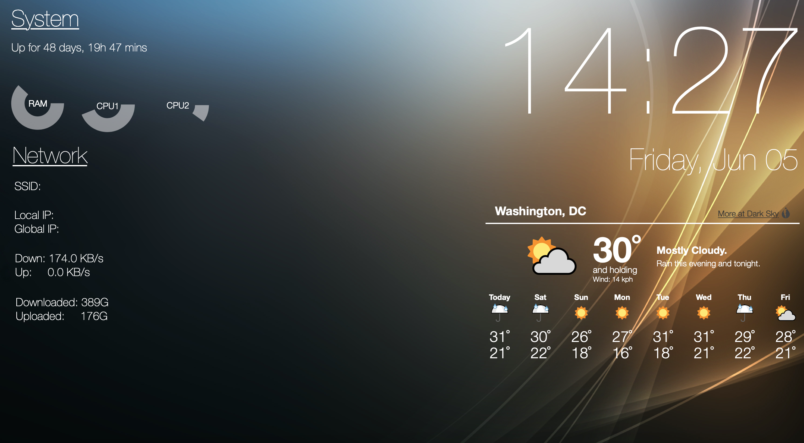

# Geeklets-hs

<p>
    <a href="https://github.com/tbidne/geeklets-hs/workflows/stack%20build/badge.svg?branch=master" alt="stack build">
        
    </a>
</p>

Copy of https://github.com/tbidne/geeklets with the backing scripts written in Haskell.

The scripts are mostly trivial and could be 100% written in bash, but it was fun to try defining the app's DSL,

```haskell
runCLI :: Freer CLI ()
runCLI = do
  args <- etaF GetArgs
  cmd <- (etaF . ParseArgs) args
  case cmd of
    PFailure s -> etaF $ PutStrLn s
    PSuccess s -> do
      res <- etaF $ RunCmd s
      etaF $ PutStrLn $ extractRResult res
```

as a very simple implementation of the Freer monad defined in [Freer Monads, More Extensible Effects](http://okmij.org/ftp/Haskell/extensible/more.pdf) by Oleg Kiselyov and Hiromi Ishii.

